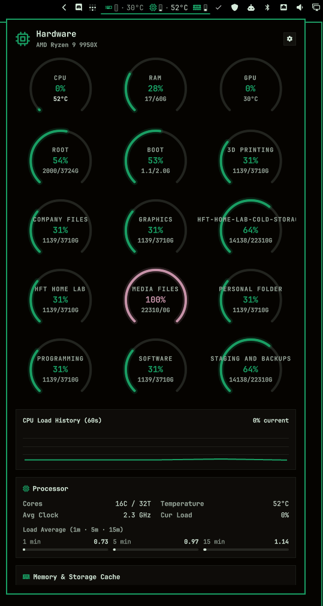
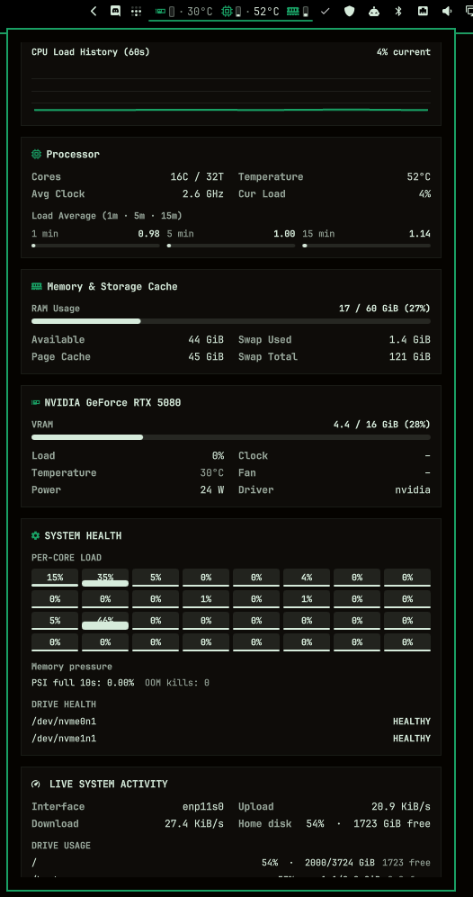
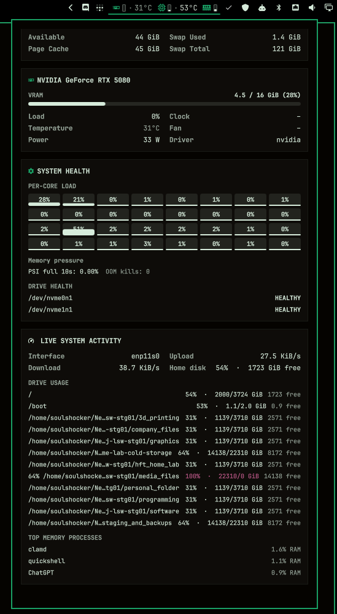
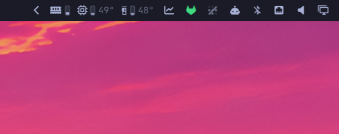
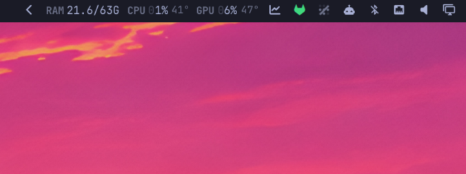

# All-in-One Monitor — Omarchy bar widget & system panel

CPU, GPU, memory, temperatures, battery, storage, network, and drive health in one Omarchy bar widget and popup panel. Right-click cycles the compact bar readout, and left-click opens the full telemetry view.


Everything is read straight from `/proc` and `/sys` inside the shell process —
with only bounded helper calls for disk capacity and slow SMART/health data.

## Screenshots







## Install

```sh
omarchy plugin add https://github.com/thetxeagle/omarchy-all-in-one-monitor.git --enable --yes

omarchy-shell shell rescanPlugins
```

Then place it where you want it and restart the shell:

```sh
omarchy bar move thetxeagle.all-in-one-monitor --section right --after omarchy.tray
omarchy restart shell
```

Nothing to configure — it finds this machine's sensors on its own.

## Usage

- **Left click** — opens the built-in visual system telemetry panel anchored to the widget (or runs `clickCommand` if configured).
- **Right click** — cycles `icons` → `compact` → `full` → `labels`, and remembers it.
- **Middle click** — resamples immediately.
- **Hover** — says what the clicks do. The full breakdown is a `status` call away (see [IPC](#ipc)).

### The system panel

Clicking the widget opens an Omarchy keyboard-driven popup panel anchored to the bar:

- **Hero summary & Unit Toggle** — core/thread count, GPU summary, and a live toggle switch between **°C** and **°F** at the top right.
- **Telemetry dials** — 270° circular gauges with live figures for CPU load & temp, RAM usage, and GPU load & temp with dynamic temperature coloring.
- **Drive dials** — one used-space gauge per mounted filesystem, with used/total capacity shown below each dial.
- **60s CPU load sparkline** — live history trend buffer sampled while open (zero background cost when closed).
- **Processor details** — full CPU model name (without cutoff), load, clock frequency, dynamic temperature color, and 1m/5m/15m load average meters.
- **Memory breakdown** — used/total GiB visual meter, available, cache, and swap usage.
- **Graphics metrics** — full GPU card name, load, dynamic temperature color, VRAM meter, power draw (W), fan RPM, and clock speeds.
- **Drive statistics** — mounted filesystem usage with used/total space, free space, mount point, and percentage used. Duplicate bind mounts collapse into one row.
- **Keyboard navigation** — `Escape` to close, `Tab`/`Shift+Tab` to switch panels, `r` to resample, `c`/`f` to toggle °C/°F.

### The four bar readouts

**`icons`** *(default)* — GPU load, CPU load, CPU temperature with thermometer icon, and RAM (e.g. `󰾲 0%    34%    46°C    11/23G`), ~150px.

**`compact`** — a glyph and a gauge per component, ~80px. The gauge fills from
the bottom and warms toward the theme's urgent colour as load climbs, so the
machine's state is readable without reading a digit.


**`full`** — the same, plus CPU and GPU temperature, ~106px. Memory has no
temperature sensor, so its gauge is the whole readout.



**`labels`** — the Waybar hardware group, tightened: no glyph, no gauge, each
label welded to its figure, ~230px.



## What it reads

- Network RX/TX rates and active interface from `/proc/net/dev`.
- Home filesystem capacity from `df -Pk /home`.
- Real mounted filesystem capacity from `df`, excluding virtual filesystems and collapsing duplicate mounts.
- Up to three top memory processes from the health helper.
- Up to 60 recent CPU, memory, and network samples in the shared service.
- Multiple detected GPUs can be selected from the popup settings drawer, or by setting `gpu` to `auto`, an index such as `0` or `1`, or a card/name substring.

`auto` prefers a usable NVIDIA adapter on multi-GPU systems, then falls back to the first sysfs-capable adapter. If an NVIDIA card is detected but its driver is unavailable, it remains selectable and is labeled accordingly, but load, temperature, and VRAM readings cannot work until `nvidia-smi` can communicate with the driver.

The popup-open indicator spans the full widget block, including all configured icons, gauges, and values.

| | Source | Shown |
|---|---|---|
| Memory | `/proc/meminfo` | used against total, measured with `MemAvailable` so reclaimable page cache is not counted as used |
| CPU load | `/proc/stat` | jiffie deltas between samples, `iowait` counted as idle — the same arithmetic `top` and `btop` use |
| CPU clock | `/proc/cpuinfo` | mean across every thread |
| CPU temperature | `hwmon` | die/package sensor, picked by scoring (`k10temp` `Tdie`/`Tctl`, `coretemp` `Package id 0`, `zenpower`, ThinkPad, ARM SoC, then `acpitz`) |
| GPU | the card's own `sysfs` | load, edge temperature, VRAM, board power, fan, core clock |
| Load average | `/proc/loadavg` | 1/5/15 minute |

An NVIDIA card is the exception: it reports none of this through sysfs, so it is
polled through `nvidia-smi` on the same interval.

## How it samples

Sensor paths are found once, at load, by [`hw-probe`](hw-probe) — a small shell
script, because working out *which* files a machine exposes means globbing
`hwmon` and matching labels, and every vendor names its sensors differently.
After that there is no forking on a timer the way a Waybar custom module does:
the widget reads the resolved files directly with `FileView`, which is what
makes a two-second interval reasonable for something that runs for the life of
your session.

`blockAllReads` is set on those views deliberately. Without it `reload()` is
asynchronous and `text()` returns the *previous* tick's contents, so every
readout lags a full interval. These are kernel-generated files of a few KB, so
a blocking read never stalls the UI.

Run the probe yourself to see what it found:

```sh
~/.config/omarchy/plugins/thetxeagle.all-in-one-monitor/hw-probe | jq
```

A sensor missing from that output is one this machine does not expose, and the
widget renders a dash rather than a zero that looks like real data.

## Settings

Settings are read from this widget's entry in `~/.config/omarchy/shell.json`:

```json
{
  "id": "thetxeagle.all-in-one-monitor",
  "mode": "icons",
  "refreshIntervalSec": 2,
  "showRam": true,
  "showCpu": true,
  "showGpu": true,
  "ramFormat": "used/total",
  "tempFormat": "degree",
  "fahrenheit": false,
  "warnPercent": 70,
  "criticalPercent": 90,
  "warnTempC": 75,
  "criticalTempC": 90
}
```

Or set dynamically from the command line:

```sh
omarchy bar set thetxeagle.all-in-one-monitor mode full
omarchy bar set thetxeagle.all-in-one-monitor fahrenheit true --json
```

| Key | Type | Default | Description |
|---|---|---|---|
| `mode` | string | `"icons"` | `"icons"`, `"compact"`, `"full"`, or `"labels"`. Right-clicking cycles them. |
| `itemsOrder` | array/string | `"gpu,cpu,cpu-temp,ram"` | Sequence of telemetry items in the top bar (`"gpu,cpu,cpu-temp,ram"` or `"gpu,cpu,cpu-temp,gpu-temp,ram"`). |
| `showGpu` | bool | `true` | Show GPU load (hidden automatically if no card was found). |
| `showCpu` | bool | `true` | Show CPU load. |
| `showCpuTemp` | bool | `true` | Show CPU temperature with thermometer icon. |
| `showGpuTemp` | bool | `false` | Show GPU temperature in the bar. |
| `showRam` | bool | `true` | Show memory / RAM usage. |
| `ramFormat` | string | `"used/total"` | `"used/total"` (`12/23G`), `"used"` (`12.3G`), `"percent"` (`52%`), `"free"` (`11.1G`), or `"available"` (`11.1G`). |
| `tempFormat` | string | `"degree-unit"` | `"degree-unit"` (`45°C`), `"degree"` (`45°`), `"unit"` (`45C`), `"unit-lower"` (`45c`), or `"bare"` (`45`). |
| `fahrenheit` | bool | `false` | Temperatures in °F instead of °C. |
| `percentPad` | string | `"none"` | `"none"`, `"zero"`, `"lead"`, or `"trail"`. |
| `showGauges` | bool | `false` | Show vertical capsule gauges. |
| `showValues` | bool | `false` | Put percentages back on the row beside each gauge in `compact`/`full` modes. (`icons` and `labels` always show them). |
| `showClocks` | bool | `false` | Show CPU and GPU clock speeds in GHz. |
| `gpuIcon` | string | `"󰾲"` | Glyph marking the GPU figure. |
| `cpuIcon` | string | `""` | Glyph marking the CPU figure. |
| `tempIcon` | string | `""` | Glyph marking the CPU temperature figure. |
| `gpuTempIcon` | string | `"󰔏"` | Glyph marking the GPU temperature figure. |
| `ramIcon` | string | `""` | Glyph marking the RAM figure. |
| `clockIcon` | string | `"󰓅"` | Glyph marking the clock figure. Empty draws the number alone. |
| `iconSize` | int | `0` | Overall scale in pixels. `0` follows the bar's icon font. |
| `refreshIntervalSec` | int | `2` | Seconds between samples. `1` is as fast as `FileView` makes sense; `5` is plenty for a background bar. |
| `gpu` | string | `"auto"` | `"auto"` picks the card reporting load; otherwise an index (`0`, `1`) or name substring. |
| `warnPercent` | int | `70` | Load threshold where numbers and glyphs warm toward the urgent colour. |
| `criticalPercent` | int | `90` | Load threshold where the gauge glows and color reaches full urgent. |
| `warnTempC` | int | `75` | Temperature threshold (°C) where figures warm toward urgent. |
| `criticalTempC` | int | `90` | Temperature threshold (°C) where temperature turns hot urgent red. |
| `clickCommand` | string | `""` | Command to run on left click. Empty opens the built-in system panel popup. |
| `monitors` | array/string | `[]` | Connector names to draw on (e.g. `["DP-1"]`). Empty draws on all screens. |

## IPC

Call methods through `omarchy-shell`:

```sh
# Open the system telemetry popup
omarchy-shell thetxeagle.all-in-one-monitor open

# Close the system panel
omarchy-shell thetxeagle.all-in-one-monitor close

# Toggle the system panel popup
omarchy-shell thetxeagle.all-in-one-monitor toggle

# Toggle Celsius / Fahrenheit
omarchy-shell thetxeagle.all-in-one-monitor toggleFahrenheit

# Cycle the display mode
omarchy-shell thetxeagle.all-in-one-monitor cycleMode

# Force an immediate resample
omarchy-shell thetxeagle.all-in-one-monitor refresh

# Dump the full multi-line telemetry breakdown
omarchy-shell thetxeagle.all-in-one-monitor status
```

## Requirements

- A Nerd Font for the glyphs, which Omarchy already ships
- `pciutils` (`lspci`) — optional, only to name the GPU card in the panel
- `nvidia-smi` — only for NVIDIA cards, installed with the driver

No pip packages, no daemon, no elevated privileges. The plugin reads `/proc`
and `/sys` and nothing else.

## Removal

```sh
omarchy plugin remove thetxeagle.all-in-one-monitor
```

That drops it from the bar, deletes the plugin, and keeps no state — there is
nothing else to clean up.

## License

MIT — see [LICENSE](LICENSE). Original work by Edgar Silva; continued and
extended by meviusisback.

## Credits

Based on [Edgar Silva's omarchy-hw-monitor](https://github.com/edgarsilva/omarchy-hw-monitor)
(MIT). This fork continues the plugin — the original repository has been
inactive since August 2026 — with the Noctalia-style readout, the visual
system panel, and per-widget settings. The original MIT license is preserved;
copyright lines in [LICENSE](LICENSE) reflect both authors.
